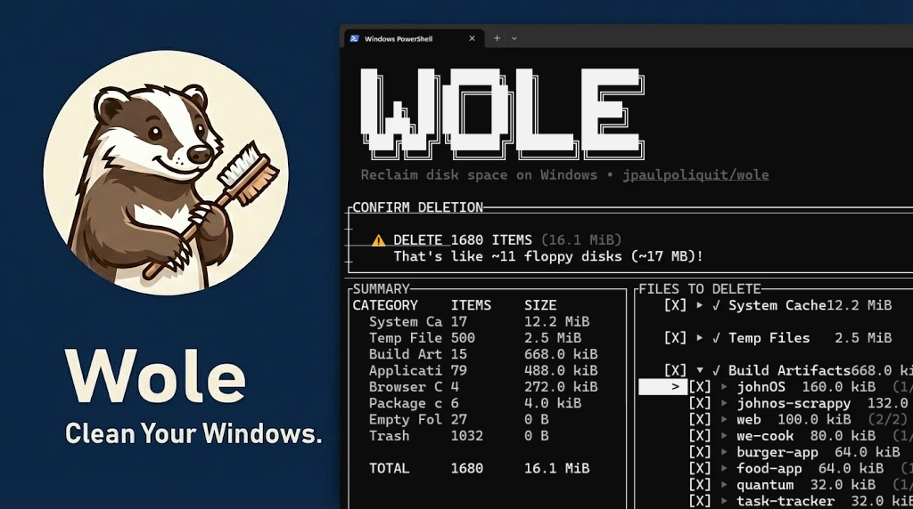

<div align="center">
  <h1>Wole</h1>
  <p><em>Deep clean and optimize your Windows PC.</em></p>
</div>

<p align="center">
  <a href="https://github.com/jpaulpoliquit/wole/stargazers"></a>
  <a href="https://github.com/jpaulpoliquit/wole/releases"></a>
  <a href="LICENSE"></a>
  <a href="https://github.com/jpaulpoliquit/wole/commits"></a>
  <a href="https://x.com/jpaulpoliquit"></a>
</p>

<p align="center">
  
</p>

## Features

- **All-in-one toolkit**: CCleaner, WinDirStat, and TreeSize combined into a **single binary**
- **Deep cleaning**: Scans and removes caches, temp files, and browser leftovers to **reclaim gigabytes of space**
- **Project-aware**: Only cleans build artifacts from inactive projects (14+ days), respecting **Git status**
- **Disk insights**: Visualizes usage, finds large files, and explores your **disk space interactively**
- **Safe by default**: Dry-run mode, Recycle Bin deletion, and **full restore capability**

## Quick Start

**Install via PowerShell — recommended:**

```powershell
irm https://raw.githubusercontent.com/jpaulpoliquit/wole/master/install.ps1 | iex
```

**Or via Bash:**

```bash
curl -fsSL https://raw.githubusercontent.com/jpaulpoliquit/wole/master/install.sh | bash
```

**Run:**

```bash
wole                          # Interactive TUI menu (recommended!)
wole scan --all               # Preview what would be cleaned
wole clean --cache --temp     # Clean caches and temp files
wole clean --trash -y         # Empty Recycle Bin
wole analyze                  # Visual disk explorer
wole analyze --interactive    # Interactive disk insights TUI
wole restore --last           # Restore files from last deletion

wole config --show            # View current configuration
wole config --edit            # Edit config in your editor
wole --help                   # Show help
wole --version                # Show installed version

wole scan --all -v            # Verbose scan with file paths
wole scan --all --json        # JSON output for scripting
wole clean --all --dry-run    # Preview cleanup without deleting
wole clean --all --permanent  # Bypass Recycle Bin (use with caution!)
```

## Tips

- **Terminal**: Works best with Windows Terminal, PowerShell, or any modern terminal emulator.
- **Safety**: Built with strict protections. See [Security Audit](SECURITY_AUDIT.md). Preview changes with `wole scan --all` or `--dry-run`.
- **Verbose Mode**: Use `-v` or `-vv` for detailed output showing file paths and scan progress.
- **Navigation**: TUI supports arrow keys for intuitive navigation.
- **Configuration**: Run `wole config --edit` to customize thresholds, exclusions, and scan paths.

## Features in Detail

### Deep System Cleanup

```bash
$ wole clean --all

Scanning for cleanable files...
Found 362 files (8.1 GB) to clean.

Cleaning...
✓ Package cache: 45 files (2.3 GB)
✓ Temp: 128 files (456 MB)
✓ Trash: 23 files (89 MB)
✓ Build: 12 files (1.2 GB)
✓ Browser: 67 files (234 MB)
✓ System: 34 files (567 MB)

====================================================================
Space freed: 8.1 GB | Free space now: 53.3 GB
====================================================================
```

### Interactive TUI Mode

```bash
$ wole

┌─────────────────────────────────────────────────────────┐
│                                                         │
│    ██╗    ██╗ ██████╗ ██╗     ███████╗                  │
│    ██║    ██║██╔═══██╗██║     ██╔════╝                  │
│    ██║ █╗ ██║██║   ██║██║     █████╗                    │
│    ██║███╗██║██║   ██║██║     ██╔══╝                    │
│    ╚███╔███╔╝╚██████╔╝███████╗███████╗                  │
│     ╚══╝╚══╝  ╚═════╝ ╚══════╝╚══════╝                  │
│                                                         │
│    Windows-first cleanup tool                           │
│                                                         │
├─────────────────────────────────────────────────────────┤
│ ACTIONS                                                 │
│                                                         │
│ > Scan        Find cleanable files (safe, dry-run)      │
│   Clean       Delete selected files                     │
│   Analyze     Explore disk usage (folder sizes)         │
│   Restore     Restore files from last deletion          │
│   Config      View or modify settings                   │
│                                                         │
├─────────────────────────────────────────────────────────┤
│ Select categories to scan:                              │
│                                                         │
│ [X] Package cache    [X] Temp    [X] Trash              │
│ [X] Build            [ ] Browser [ ] System             │
│                                                         │
└─────────────────────────────────────────────────────────┘
[↑↓] Navigate  [Space] Toggle  [Enter] Confirm  [Esc] Exit
```

### Disk Space Analyzer

```bash
$ wole analyze

Disk Insights: C:\Users\user
Total: 120 GB │ 15,234 files

#  ████████████████████  100.0%  120 GB
   C:\Users\user

1  ████████████████░░░░   85.2%  102 GB  Projects
2  ████░░░░░░░░░░░░░░░░   18.5%   22 GB  Downloads
3  ██░░░░░░░░░░░░░░░░░░    8.3%   10 GB  Documents

Largest Files:
  45 GB  C:\Users\user\Projects\game\assets.bin
  12 GB  C:\Users\user\Downloads\movie.mkv

[↑↓] Navigate  [Enter] Open  [Esc] Back  [S] Sort
```

### Project-Aware Build Cleanup

Clean old build artifacts (`node_modules`, `target`, `bin/obj`, etc.) from inactive projects while respecting Git status.

```bash
$ wole clean --build

Scanning for cleanable files...

Build                12    1.2 GB    [OK] Inactive projects
  C:\Users\user\Projects\old-react-app\node_modules
  C:\Users\user\Projects\rust-experiment\target
  C:\Users\user\Projects\dotnet-api\bin
  ... and 9 more

====================================================================
Space freed: 1.2 GB
====================================================================
```

> **Smart detection:** Only cleans projects inactive for 14+ days. Skips projects with recent commits or uncommitted changes.

### Scan Results

```bash
$ wole scan --all

╔════════════════════════════════════════════════════════════╗
║                    Wole Scan Results                       ║
╠════════════════════════════════════════════════════════════╣

Category         Items      Size         Status
────────────────────────────────────────────────────────────
Package cache        45    2.3 GB    [OK] Safe to clean
Temp                128    456 MB     [OK] Safe to clean
Trash                23    89 MB      [OK] Safe to clean
Build                12    1.2 GB    [OK] Inactive projects
Browser              67    234 MB     [OK] Safe to clean
System               34    567 MB     [OK] Safe to clean
Large                 8    2.1 GB   [!] Review suggested
Old                  45    890 MB   [!] Review suggested
────────────────────────────────────────────────────────────
Total              362    8.1 GB         Reclaimable

Run wole clean --all to remove these files.
```

### File Restore

Easily restore files from your last deletion session.

```bash
$ wole restore --last

Restore files from last deletion session

[X] C:\Users\user\Documents\file1.txt (2.3 MB)
[X] C:\Users\user\Downloads\file2.zip (45 MB)
[ ] C:\Users\user\Temp\file3.tmp (128 KB)

Selected: 2 files (47.3 MB)

✓ Restored 2 files (47.3 MB)
```

## Categories


| Flag           | Description                                                                         |
| -------------- | ----------------------------------------------------------------------------------- |
| `--cache`      | Package manager caches (npm/yarn/pnpm, NuGet, Cargo, pip)                           |
| `--app-cache`  | Application caches (Discord, VS Code, Slack, Spotify)                               |
| `--temp`       | Windows temp files older than 1 day                                                 |
| `--trash`      | Recycle Bin contents                                                                |
| `--build`      | Build artifacts from inactive projects (`node_modules`, `target/`, `bin/obj`, etc.) |
| `--browser`    | Browser caches (Chrome, Edge, Firefox, Brave, etc.)                                 |
| `--system`     | Windows system caches (thumbnails, updates, icons)                                  |
| `--downloads`  | Old files in Downloads (30+ days)                                                   |
| `--large`      | Large files (100MB+)                                                                |
| `--old`        | Files not accessed in 30+ days                                                      |
| `--empty`      | Empty folders                                                                       |
| `--duplicates` | Duplicate files                                                                     |


**Note:** Only `--build` is project-aware. Other categories clean files system-wide.

## Options

**Common:**

- `--all` - Enable all categories
- `--exclude <PATTERN>` - Exclude paths (repeatable)
- `--json` - JSON output for scripting
- `-v`, `-vv` - Verbose output
- `-q` - Quiet mode

**Scan:**

- `--project-age <DAYS>` - Project inactivity threshold for `--build` (default: 14)
- `--min-age <DAYS>` - Minimum file age for `--downloads` and `--old` (default: 30)
- `--min-size <SIZE>` - Minimum file size for `--large` (default: 100MB)

**Clean:**

- `-y`, `--yes` - Skip confirmation
- `--permanent` - Bypass Recycle Bin
- `--dry-run` - Preview only

## Configuration

Config file: `%APPDATA%\wole\config.toml`

```toml
[thresholds]
project_age_days = 14
min_age_days = 30
min_size_mb = 100

[exclusions]
patterns = ["**/important-project/**"]
```

```bash
wole config --show    # View config
wole config --edit    # Edit config
```

## Building from Source

**Prerequisites:** Rust, Visual Studio Build Tools

```powershell
cargo build --release
```

**Output:** `target\release\wole.exe`

## Troubleshooting

- **File locked:** File is open in another app. Will be skipped automatically.
- **Long paths:** Handled automatically. Update if issues persist.
- **Symlinks:** Automatically skipped (expected behavior).
- **TUI not working:** Use PowerShell/Windows Terminal, or CLI mode: `wole scan --all`
- **No items found:** Check project activity with `--project-age 0` or file ages with `--min-age 0`

## Support

- If Wole saved you disk space, consider starring the repo or sharing it with friends.
- Have ideas or fixes? Check our [Contributing Guide](CONTRIBUTING.md), then open an issue or PR.
- Follow the author on [X (Twitter)](https://x.com/jpaulpoliquit) for updates!

## License

[MIT License](LICENSE) — feel free to enjoy and participate in open source.